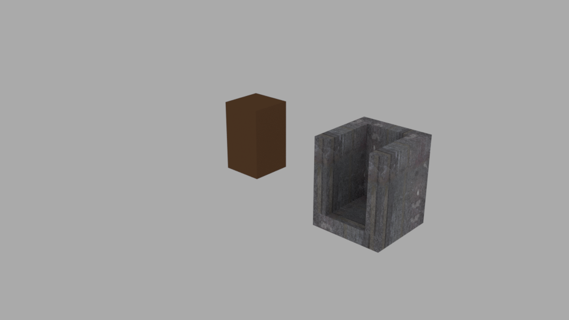
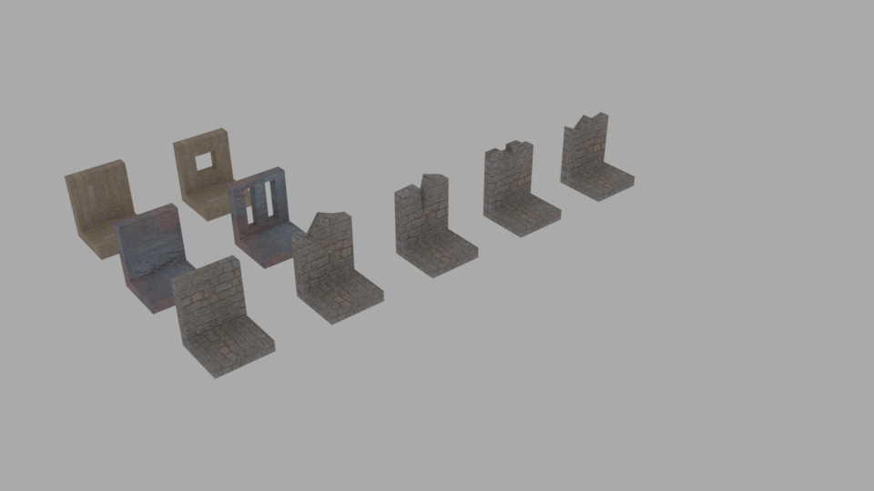

==================
Dungeon on the fly
==================

A project in the course Procedural methods for images, TNM022
-------------------------------------------------------------

:Date: |date|
:Author: Morgan Bengtsson
:Contact: benmo417@student.liu.se, bengtsson.morgan@gmail.com
:Verson: 1.0
:Abstract: Write last lorem ipsum bla bla bla

.. |date| date::

Introduction
------------

This is a report for the final project in the course Procedural methods for images, TNM022 at Linköping university. 

Procedural methods for generating content for games is an attractive subject. Done right it can help to give the appearance of very big game world, without to much work regarding modeling and texturing. There are different routes to take when doing things procedurally. Either everything is fully procedural. Within the realm of 3D graphics meaning that, from each vertex in the models to every pixel in the textures are generated from mathematical functions. Another option is to combine procedural methods with manually made building blocks. This is the approach taken in this work, where predefined components are used with adjustable parameters to affect their appearance. Procedural methods can then be used to adjust the parameters. Also to choose what components are created, where they are placed, how many and so forth. This approach is often called shape algebra or procedural modeling. In this work theese ideas are used to generate a dungeon, inspired from old games such as Daggerfall.

.. figure:: daggerfall.jpg
   :width: 70%   
   :align: center
   :name: daggerfall
   
   A dungeon from the old game Daggerfall (excuse the pixels).

Noise
-----
The mathematical functions used for generating values are arbitrary. Though in this work mainly noise functions are used. An inportant property of them is that they are deterministic, meaning that the same input values will always generate the same output. Hence with the same input the exact same dungeon will be generated again in the end. This is important for games, since if the player comes back to a location, the same geometry should be present. Noise is also artistically pleasant for creating sense of randomness, while the predefined components gives a sense of structure. Further are two important noise methods described.

simplex_int_ is a method that generates deterministic random values within a defined range. Three dimensional inputs are most often used, though others types are supported.

.. code:: c++
   :name: simplex_int
   
   template<class T>
   int simplex_int(const T &seed, const int min, const int max) {
     // Noise value in range -1.0f, 1.0f.
     auto s = glm::simplex(seed);

     // Scale it to the min , max range.
     auto n = (((s + 1.0f) * (max - min)) / 2.0f) + min;
     return int(n);
   }

simplex_bool_ is a convenience method that either gives true or false depending on the input.

.. code:: c++
   :name: simplex_bool
   
   template<class T>
   bool simplex_bool(const T &seed) {
      return glm::simplex(seed) > 0.0f ? true : false;
   }

Components
----------
There are two types of components defined to generate the dungeon: doors and entities. 

----
Door
----

Doors are small objects that define the connection between two entities. A door consist of a transform matrix, a pointer to the next entity and a `model for rendering`__. The door has two *states*, open and closed, which are set by the simplex_bool_ function. Input is the door position.

__ door_model_

.. figure:: doors.png
   :width: 70%   
   :align: center
   :name: door_model
   
   Door model with two states, open and closed.

------
Entity
------

The entity is a base component that the following components are based from. The
common denominator is that an entity can contain several doors that lead to new entities. All entities also takes a transformation matrix that specifies where the entity should be generated. Each entity also contains a bounding box that is used for collision detection in the `algorithm`_.

Corridor
========

The corridor is a simple entiy where the only adjustable parameter is its *length*. The length is defined with the simplex_int_ function with position as input. At the end of the corridor an exit door is created. Only one `model`__ is used for rendering and it is repeated until the desired length is reached. 

__ corridor_model_

.. figure:: corridor.png
   :width: 70%   
   :align: center
   :name: corridor_model
   
   The corridor model.

Elevator
========

The elevator is similar to the corridor_ entity. With the difference that it extends in the vertical direction. Hence the *height* is the only adjustable parameter, populated by the simplex_int_ function, with position as input. The model for this entity looks a bit different since it also has an animated cart, as shown in the `image`__. The model is repeated vertically until the desired height is reached.

__ elevator_model_

Room
====

The room is the most advanced and most configurable entity. Meaning that it can change much in appearance depending on what values are used to create it. The main values are it *size* in two dimensions and room *type*. The simplex_int_ function is used to initialize theese, with position as input. The input position is scaled a bit for the second *size* dimension, to not get square rooms. 

Another value that is generated from the noise function is the room type. There are three types of room types and many walls and floor combinations as seen in the room_figure.
As seen in the `room edges`_ figure. There are several room edge types.

   
   Different types of room edge variations.

------
Stairs
------

Items
-----

Algorithm
---------

To generate a dungeon the first entity has to be created manually. Then a loop iterates a defined number of times. Each time the loop checks for doors in each entity that has an empty pointer to their next entity. If that is the case a new entity is generated and linked to that pointer. 

What type of entity that is generated is decided by a method that takes a seed value as input. In this case the door position is used for that. The seed is put into a simplex noise function and rounded to nearest integer. This integer decides what type of entity is created. 

Before the entity is linked to the door. The entities bounding box is checked for collision with all other bounding boxes in the level. If a collision is detected, the entity is discarded and the door hence leads nowhere. 

Implementation
--------------

The implementation is done in C++ with a couple of helper libraries. One is mos, mainly used for defining models and meshes for rendering. Another important one is GLM, whish is used for all the math. And especially the simplex noise method that is essential for the algorithm.

The level is generated in its own thread at startup, to not stall the rendering.

Results
-------

