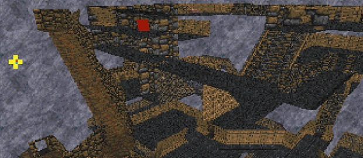
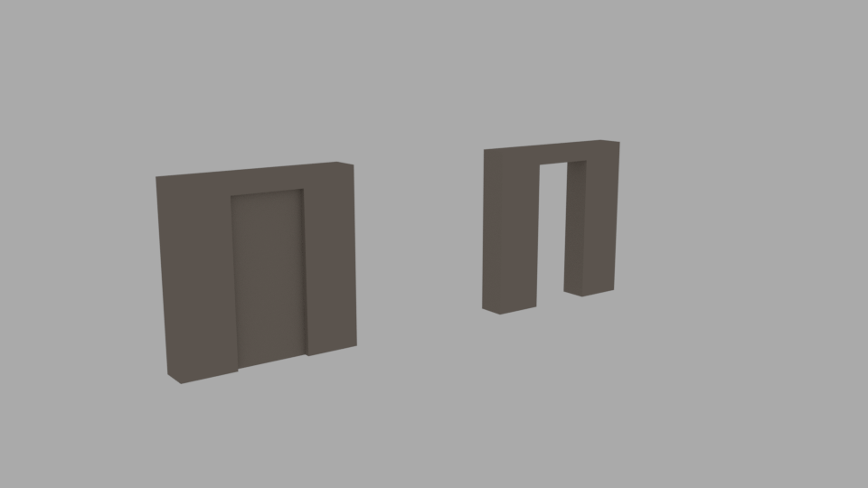
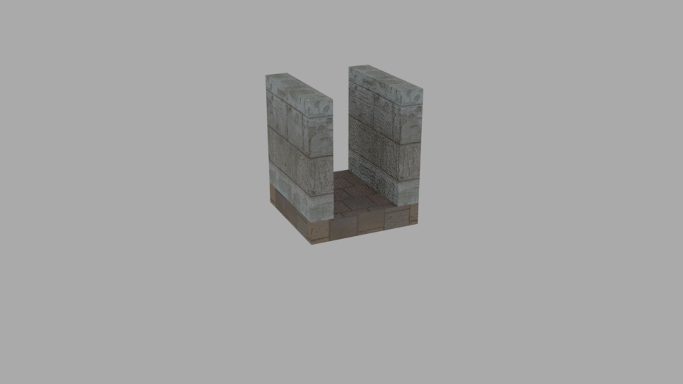
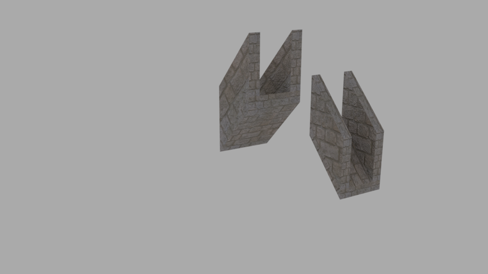
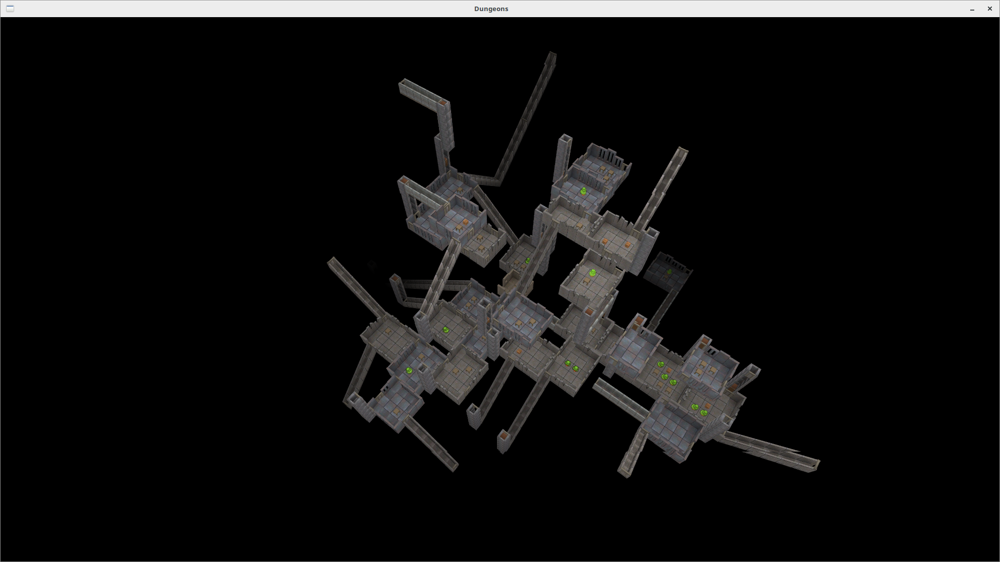

==================
Dungeon on the fly
==================

A project in the course Procedural methods for images, TNM022
-------------------------------------------------------------

:Date: 2016-12-13
:Author: Morgan Bengtsson
:Contact: benmo417@student.liu.se, bengtsson.morgan@gmail.com
:Verson: 1.0
:Abstract: Methods for procedural modeling are analysed. Mainly by using procedurally adjustable building blocks. Which resulted in an application that generates a complete and versatile dungeon.

Introduction
------------

This is a report for the final project in the course Procedural methods for images, TNM022 at Linköping university. 

Procedural methods for generating content for games is an attractive subject. Done right it can help to give the appearance of very big game world, without to much work regarding modeling and texturing. There are different routes to take when doing things procedurally. Either everything is fully procedural. Within the realm of 3D graphics meaning that, from each vertex in the models to every pixel in the textures are generated from mathematical functions. Another option is to combine procedural methods with manually made building blocks. This is the approach taken in this work, where predefined components are used with adjustable parameters to affect their appearance. Procedural methods can then be used to adjust those parameters. Furthermore also to choose what components are created, where they are placed, how many and so forth. This approach is often called shape algebra or procedural modeling. In this work these ideas are used to generate a dungeon, inspired from old games such as Daggerfall_.

   
   A dungeon from the old game Daggerfall.

Noise
-----

The mathematical functions used for generating values are arbitrary. Though in this work mainly noise functions are used. An important property of them is that they are deterministic, meaning that the same input values will always generate the same output. Hence with the same input the exact same dungeon will be generated again in the end. This is important for games, since if the player comes back to a location, the same geometry should be present. Noise is also artistically pleasant for creating sense of randomness, while the predefined components gives a sense of structure. The main noise functions used throughout the implementation are described below:

simplex_range_ is a function that generates deterministic random values within a defined range. Three dimensional inputs are most often used, though others types are supported. The function is available in an integer and a float variant.

.. code:: c++
   :name: simplex_range
   
	template<class T>
	int simplex_range(const T &seed, const int min, const int max) {
	  // Noise value in range -1.0f, 1.0f.
	  auto s = glm::simplex(seed);

	  // Scale it to the min , max range.
	  auto n = (((s + 1.0f) * (max - min)) / 2.0f) + min;
	  return int(n);
	}

	template<class T>
	float simplex_range(const T &seed, const float min, const float max){
	  // Noise value in range -1.0f, 1.0f.
	  auto s = glm::simplex(seed);

	  // Scale it to the min , max range.
	  auto n = (((s + 1.0f) * (max - min)) / 2.0f) + min;
	  return n;
	}

simplex_bool_ is a convenience method that either gives true or false depending on the input.

.. code:: c++
   :name: simplex_bool
   
   template<class T>
   bool simplex_bool(const T &seed) {
      return glm::simplex(seed) > 0.0f ? true : false;
   }

Components
----------
There are two types of components defined to generate the dungeon: doors and entities. 

----
Door
----

Doors are small objects that define the connection between two entities. A door consist of a transform matrix, a pointer to the next entity and a `model for rendering`__. The door has two *states*; open and closed, which are set by the simplex_bool_ function. Input for that method is the door position.

__ door_model_

   
   Door model with two states, open and closed.

------
Entity
------

The entity is a base component that the following components are based from. The
common denominator is that an entity can contain several doors that lead to new entities. An entity takes a transformation matrix that specifies where the entity should be generated. Each entity also contains a bounding box that is used for collision detection in the `algorithm`_.

Corridor
========

The corridor is a simple entity where the only adjustable parameter is its *length*. The length is defined with the simplex_range_ function with position as input. At the end of the corridor an exit door is created. Only one `model`__ is used for rendering and it is repeated until the desired length is reached. 

__ corridor_model_

   
   The corridor model.

Elevator
========

The elevator is similar to the corridor_ entity. With the difference that it extends in the vertical direction. Hence the *height* is the only adjustable parameter, populated by the simplex_range_ function, with position as input. The model for this entity looks a bit different since it also has an animated cart, as shown in the `image`__. The model is repeated vertically until the desired height is reached.

__ elevator_model_

.. figure:: elevator.png
   :width: 70%
   :align: center
   :name: elevator_model
   
   The elevator model, with the cart to the left.

Room
====

The room is the most advanced and most configurable entity. Meaning that it can change much in appearance depending on what values are used to create it. The main values are its *size* in two dimensions and the room *type*. The simplex_range_ function is used to initialize both, with room position as input. The input position is scaled a bit for the second *size* dimension, to not get square rooms. 

The *type* value determines which set of models to use when creating the room. There are three sets, one with stone material one with metal material and one with wood material. There are several models that builds a room such as floor, edge models and corners. Some of the variations are shown in the `room edges`_ figure.

.. figure:: room_edges.png
   :width: 70 %
   :align: center
   :name: room edges
   
   Different types of room edges.

When the room *type* is determined, the corresponding set of models are used to build the room. A two dimensional loop fills the room with models. Edge models for walls, special models for corners, entries, exits and floor models in the middle. What model variation that is used depends on the simplex_range_ function with model position as input. As seen in the `room edges`_ figure, the stone material room has many variations. Walls are also varied slightly in height with the simplex_range_ function.

------
Stairs
------

Stairs are similar to the corridor_ with its only adjustable parameter being its *length*. This variable is again populated by the simplex_range_ method with position as input. The difference is that the stairs extends both vertically and horizontally. An exit door is added to the end of the model. There two versions of this entity, one that goes up and one that goes down, as shown in the `stairs models`_ figure.

   
   Stairs up and down.

Items
-----

To further spice up the environment, some extra items are added to each room_. If they are placed on a floor model in the room_ depends on the simplex_bool_ function and the model position. Which item is used is determined by simplex_range_, and the same position. The `item models`_ are shown below:

.. figure:: items.png
   :width: 70 %
   :align: center
   :name: item models
   
   A table, a package and a tree.

Algorithm
---------

To generate a dungeon the first entity has to be created manually. Then a loop iterates through all the entities, a defined number of times. Each time the loop checks for doors in each entity that has an empty pointer to their next entity. If that is the case a new entity is created and linked to that pointer. 

Before the entity is linked to the door. The entity bounding box is checked for collision with all other bounding boxes in the level. If a collision is detected, the entity is discarded and the door hence leads nowhere. The door state is marked as closed in this case.

What type of entity that is generated is decided by a method that takes the door position as input and uses the simplex_range_ method to get an index value. The index value is used on a container filled with all types of entities described in previous sections. When each entity is created it takes the door transform as input for further processing.

Implementation
--------------

The implementation is done in C++ with a couple of helper libraries. One is Mos_, mainly used for defining models and meshes for rendering. Another important one is GLM_, which is used for all the maths. Especially the simplex noise method that is essential for the algorithm_ and the procedural nature of all the entities. All models are made with Blender_.

The level is generated in its own thread at start up, to show how the dungeon generates and not to stall the rendering.

The code itself is available at https://github.com/morganbengtsson/dungeon and can be downloaded with the following git command:

.. code:: bash

	git clone --recursive https://github.com/morganbengtsson/dungeon.git

.. _Mos: https://github.com/morganbengtsson/mos
.. _GLM: http://glm.g-truc.net/0.9.8/index.html
.. _Blender: https://www.blender.org/

-----
Build
-----

The application uses CMake_ as the build system. To build, create a directory named *build* in the downloaded source  directory. From the *build* directory run the following command:

.. code:: bash

   cmake ..

This should generate appropriate Makefiles for the Linux platform, or a Visual Studio project on the Windows platform.

.. _CMake: https://cmake.org/

Results and discussion
----------------------

A video_ of the resulting application is available along with a screenshot_ below:

.. _video: https://www.youtube.com/watch?v=-ZhnmNAsNJo

   
   The resulting dungeon after six iterations.
   

The results for generating a dungeon procedurally this way are quite positive. With only a few basic models it is possible to generate a quite versatile dungeon. Many parameters are tweak-able, to quickly get a desired result. In contrast to manual modeling, which would take much longer. Also the numerical representation of a whole dungeon is very compact, only the first entity and a position.

Improvements that could be done are optimizations to the rendering. Even more variations in the different entities. The room_ could be customized even further for example. With more floors, different shapes and materials. Procedural methods could have been used even further, to place or randomize vertex positions in the models. That would be at the cost of performance though.
